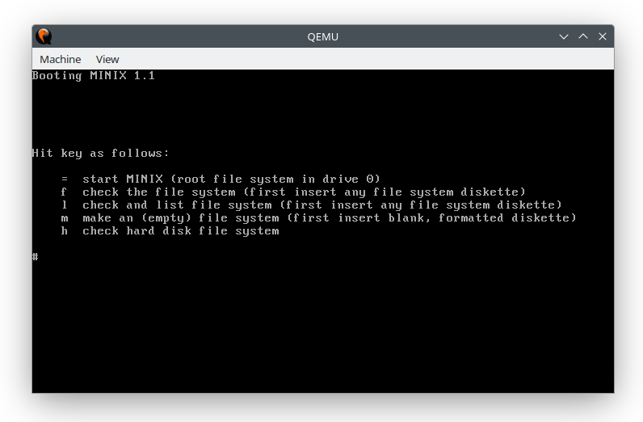

# minix1.1
Source of minix version 1.1 with changes, that are needed for running in qemu
and modern real pc with floppy disk. Bellow is instructions for creating of
bootable foppy disk, or testing it under Linux and qemu.

Compiling source code direct under linux or modern OS isn't currently possible.
Main problem is in 16-bit compiler, that don't works like is excepted,
respective if at least existed. For this reason I created releas, that is
compiled in minix 1.1 with changes tat is int this repository.

Compiling under minix 1.1 is unconfortable, because this OS is very old, slow,
has absense modern commands, for today absolutely not user friendly. In source
directory exist file cc.c, but he don't have full implementing of compiler.
This code runs another programs, tha isn't on minix source disk. This source
codes is possible find in ACK compiler:
https://github.com/davidgiven/ack

I compiled last version of this compiler direct for linux, but he don't make
16-bit code. Unfortunately I don't sucsesfull compile old versin this compiler
from 1987.

Minix 1.1 have some main restrictions that result from his nature. In 16-bit
real mode is possible addresate only 1MB of ram. Also don't exist paging and
after running any command is first needed completly load he binary copy into
ram. On ram rezidate kernel on lowwer addresses. Kernel is folowed by ram disk,
that occupies ROOT file system. He is distibute on disk2. On 1.2MB ROOT disk
is file system, that don't occupide totally place of disk. This diskete is from
larger part empty and therfore is possible fit he content into ram disk.

The other commands are in USR disk, that must be permanently mounted in floppy,
if we need use standard command like ls,pwd, cp, cc, as, make etc.

Main reason, why is minix so slow is:
1) wasting of time moving of binary copy of commands and other files into ram
2) small ara for buffering blocks because small amount of free ram

It might sweem, that when this system is relative very simply, may to provide
on other hand lower load and higher speed of executing commands and he booting,
but in real for reasons mentioned above it isn't true. For more informatin
about old minix and is possible get from book:

https://archive.org/details/sams-operating.-systems-design.and.-implementation.-1987

## formatting of floppy disk under linux
Floppy diskk (FD) can be formated on diffrent size. On relaible floppy disk and
floppy disk drive (FDD) can be reached higher size. Higher formated size paid
for smaller reliability, but on other side bellow formated size can be used on
less reliability FD and FDD. For low level formatting under Linux is used
utility `fdformat`. Utility can be used by follows:

```
fdformat device
```

,where device is device name of specific FDD, for examle `/dev/fd0`.

Device name of FD with specific size is needed creat own by 
Device name of FD with required size is needed used right device name if exist
in Linux, or if not, is requiered create own. For creating device name exist
under Linux utility `mknod`. Utility can be used by follows:

```
mknod device type major minor
```

,where
	`device` is file device name, that will be created, for example `/dev/fd0`
	`type` means type of device, for block device, that floppy is `type=b`,
	`major` is major numer of device, for FDD `major=2`,
	`minor` represent precise specific device, for FDD menas specific number of
		FDD and size of floppy disk,

Minor number of FDD is calculate by equation:
	*minor = FDDN + 4 * ISD*
, where *FDDN* is number of physical floppy disk drive (usualy on computer with
	one FDD is FDDN=0). On Linux can be *FDDN*=<0,3>
	*ISD* is index into table with choises property of floppy disk. This index
	can be chosed from variable *floppy_type*, that is in kernel source:

	https://elixir.bootlin.com/linux/v6.16-rc1/source/drivers/block/floppy.c
Minor also is partically documented on `man fdformat` with examples of specific
device name.

For own specific purpose we need block floppy disk driver with size of 1.2MB
and propably on FDD 0 (if pc have more than one FDD, number can be different).
Index *ISD* into table *floppy_type* for 1.2MB is 2, and thefore
`minor=0+4*2=8`.

Command for creating this specific device number is:

```
sudo mknod /dev/fd0h1200 b 2 8
```

And after that we can format disk exactly on 1.2MB by typing command:

```
sudo fdformat /dev/fd0h1200
```

## writing floppy disk under linux
First is needed download changed boot image from github:

https://github.com/Kosmonova/minix1.1/releases

Next we move into directory, where is saved
*MINIX11-1200K-DISK1-BOOT-changed.img* and type into terminal command:

```
dd if=MINIX11-1200K-DISK1-BOOT-changed.img of=/dev/fd0h1200
```

Another image disk don't have problems and not needed any changes for running
on qemu or real modern pc. Those images can be downloaded from:

https://www.pcjs.org/software/pcx86/sys/unix/minix/1.1/pc-at/

For running minix 1.1 is required disk *MINIX11-1200K-DISK2-ROOT.img* and
*MINIX11-1200K-DISK3-USR.img*. If we need compile source kernel, we need
*MINIX11-1200K-DISK4-KERNEL.img* and *MINIX11-1200K-DISK5-TOOLS.img* or
create own floppy disk with source codes from this repository.
For creating other strictly necessary images mentioned abowe we folows comands:

```
dd ifMINIX11-1200K-DISK2-ROOT.img of=/dev/fd0h1200
```

and for usr floppy disk:

```
dd if=MINIX11-1200K-DISK3-USR.img of=/dev/fd0h1200
```

## running minix 1.1 under qemu

Boot disket starts with 512B boot sector, that BIOS automaticly load into ram
into address starting at 0x7C00. After that BIOS check, if boot sector end with
2 bytes magic number 0xAA55. If this bytes equals, then BIOS start execute
instructions from ram address at 0x7C00, where is boot sector loaded.

Minix 1.1 boot disk don't have on end of boot sector 0xAA55. I don't know, why,
but on real pc it isn't problem and BIOS execute boot anyway. In qemu emulator
this don't allow execute this boot. For that these boot diskete is needed run
in qemu with switch `-no-fd-bootchk`. For running boot disk in qemu typing
in terminal:

```
qemu-system-i386 -fda MINIX11-1200K-DISK1-BOOT-prepared.img -boot a \
-no-fd-bootchk -monitor stdio
```



After showing window above, change floppy disk in FDD0 on root diskete by
typing into qemu terminal:

```
QEMU 8.2.2 monitor - type 'help' for more information
(qemu) change floppy0 MINIX11-1200K-DISK2-ROOT.img raw
(qemu) 
```

After that hit key `=` for load root disk into ram disk. Loading ending
with screen like that:


Next minix wants usr floppy disk, where are utilities and will be mounted
on /usr directory. For that typing on qemu terminal:

```
(qemu) change floppy0 MINIX11-1200K-DISK3-USR.img raw
(qemu) 
```


Minix wants enter date in format MMDDYYhhmmss. It's good idea set this time,
if you wannt build kernel, because it used make. Setting time into current
years don't wokrs for me. Maximum year, that works me is into 1999.


For login into `root` is password `Geheim`.


## mounting source disk in qemu

Minix 1.1 like was mentioned above need permanently mounted on floppy0
disk usr. For this reason we need use second floppy1 for mounting
disk with source codes:

```
qemu-system-i386 -fda MINIX11-1200K-DISK1-BOOT-prepared.img -boot a \
-fdb MINIX11-1200K-DISK4-KERNEL.img -no-fd-bootchk -monitor stdio
```

Next procedures is the same like in description above.

In minix console is shown, how is possible mounting floppy1 into hi
file system internally:


